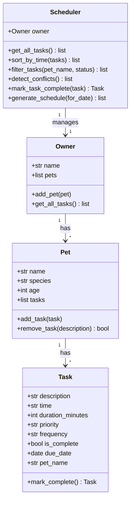

# PawPal+ Project Reflection

## System Design

**Three core user actions**

1. **Add a pet** — enter a name, species, and age; the system stores the pet under the current owner.
2. **Schedule a task** — attach a named activity (walk, feeding, medication, etc.) to a specific pet with a time, duration, priority, and recurrence frequency.
3. **View today's schedule** — see all pending tasks for the current date, sorted by time, with conflict warnings and one-click task completion.

---

## 1. System Design

**a. Initial design**

The initial UML identified four classes with clear, separated responsibilities:

| Class | Responsibility |
|-------|---------------|
| `Task` | Holds a single care activity: description, scheduled time, duration, priority, frequency, completion state, and due date. Knows how to produce its own next occurrence. |
| `Pet` | Aggregates tasks for one animal. Owns `add_task` / `remove_task` operations and stamps each task with its `pet_name`. |
| `Owner` | Aggregates pets and exposes a convenience method (`get_all_tasks`) that flattens all tasks across all pets into a single list. |
| `Scheduler` | Takes an `Owner` reference and provides all algorithmic operations: `sort_by_time`, `filter_tasks`, `detect_conflicts`, `mark_task_complete`, and `generate_schedule`. Keeps all scheduling intelligence in one place. |

Relationships: `Owner` 1-to-many `Pet`; `Pet` 1-to-many `Task`; `Scheduler` uses `Owner`.

Mermaid class diagram:

**b. Design changes**

One change made during implementation: `mark_complete` was initially placed only on `Scheduler`. During implementation it became clear that a `Task` should own its own recurrence logic (it knows its own frequency and due date), while `Scheduler.mark_task_complete` acts as a coordinator that calls `task.mark_complete()` and then registers the returned successor with the correct `Pet`. This separation kept each class's responsibility clean and made the recurrence logic independently testable.

A second change was adding a secondary sort key to `generate_schedule`: within the same time slot, tasks are ranked by priority (high → medium → low). This was a small but meaningful improvement over pure time ordering.

---

## 2. Scheduling Logic and Tradeoffs

**a. Constraints and priorities**

The scheduler considers:
- **Date** — only tasks due on the requested date are included in the daily schedule.
- **Completion state** — completed tasks are excluded from the schedule.
- **Time** — tasks are sorted chronologically so the owner sees the day unfold in order.
- **Priority** — within the same time slot, high-priority tasks appear first.
- **Recurrence** — daily and weekly tasks automatically generate a successor when completed, so recurring care never falls through the cracks.

Priority and date were treated as the most important constraints because a pet care app must ensure critical tasks (medication, feeding) are never buried under optional ones, and the owner only wants to see what is relevant today.

**b. Tradeoffs**

The conflict detector flags only **exact time matches** within the same pet — it does not check whether task durations cause overlap (e.g., a 30-minute walk starting at 08:00 overlapping a task at 08:15). This was a deliberate tradeoff: duration-based overlap detection requires knowing absolute start times converted to minutes, handling edge cases around midnight, and significantly more code. For a first version targeting a single owner managing a handful of pets, exact-time collision detection catches the most likely scheduling mistake (accidentally adding two things at the same literal time) without the added complexity. A future iteration could implement interval-based overlap detection using `(time_in_minutes, time_in_minutes + duration)` tuples.

---

## 3. AI Collaboration

**a. How you used AI**

AI assistance was used across all phases of the project:

- **Design brainstorming** — asked for feedback on the four-class architecture and whether responsibilities were well separated.
- **Code generation** — generated the initial class skeletons, then iteratively refined method signatures and docstrings.
- **Algorithmic suggestions** — asked how to use Python's `sorted()` with a lambda key to sort `"HH:MM"` strings correctly, and how to use `timedelta` for recurrence logic.
- **Test generation** — asked for edge cases to test (empty pet, already-completed task, duplicate time, different pets same time) then reviewed and refined the generated test stubs.
- **Debugging** — used inline chat to diagnose a `UnicodeEncodeError` on Windows caused by emoji characters in print statements.

The most useful prompt pattern was specificity: instead of "write tests," prompting with "write a pytest test that verifies marking a daily task complete creates a new task due tomorrow" produced directly usable output.

**b. Judgment and verification**

An early AI suggestion placed all recurrence logic inside `Scheduler.mark_task_complete`, making `Task.mark_complete()` a simple flag-setter. This was rejected because it meant `Scheduler` had to know about task frequencies and date arithmetic — logic that belongs to `Task` itself. The corrected design keeps `Task` self-sufficient (it computes its own successor) and `Scheduler` as a coordinator (it receives the successor and routes it to the right pet). This was verified by checking that the recurrence tests passed with `Task` alone, independent of `Scheduler`.

---

## 4. Testing and Verification

**a. What you tested**

21 automated tests across 6 test classes:

| Behavior | Why it matters |
|----------|---------------|
| `mark_complete` flips `is_complete` | Core data integrity — a task must actually be marked done |
| Daily/weekly tasks produce correct successor | Ensures recurring care never silently disappears |
| `add_task` increases pet task count | Verifies tasks are actually stored |
| `add_task` stamps `pet_name` | Ensures filtering and conflict detection work correctly later |
| `sort_by_time` orders chronologically regardless of insertion order | Scheduling is only useful if the order is correct |
| `filter_tasks` by pet name and status | Users only want to see relevant tasks |
| Conflict detection flags same-pet same-time | Prevents accidentally double-booking a pet's slot |
| Conflict detection ignores different pets at same time | Avoids false positives |
| `generate_schedule` excludes wrong dates and completed tasks | The daily view must be accurate |
| Empty-pet edge case | The scheduler must not crash with no data |

**b. Confidence**

Confidence level: ★★★★☆ (4/5)

The happy paths and most common edge cases are covered. Edge cases worth adding next:
- A pet with 100+ tasks (performance)
- Tasks where time is `"00:00"` or `"23:59"` (boundary values)
- Owner with no pets at all
- `generate_schedule` called for a past or future date with a mix of recurring and one-time tasks

---

## 5. Reflection

**a. What went well**

The clean separation between `Task`, `Pet`, `Owner`, and `Scheduler` paid off significantly during testing. Because each class has a single, clear responsibility, tests could be written for `Task.mark_complete()` in complete isolation without needing an `Owner` or `Scheduler` in scope. That made failures easy to pinpoint.

**b. What you would improve**

The conflict detector is currently limited to exact time matches. A future iteration would implement interval-based overlap detection — storing tasks as `(start_minute, start_minute + duration)` intervals and checking for intersections using a sweep-line approach. This would catch cases like a 45-minute walk at 08:00 conflicting with a vet appointment at 08:30.

A second improvement would be persistent storage (SQLite or a JSON file) so the schedule survives a browser refresh or app restart, rather than living only in `st.session_state`.

**c. Key takeaway**

The most important lesson from this project was that AI tools are most valuable when you come to them with a clear design question, not an open-ended one. "Write me a pet scheduling app" produces bloated, generic code. "Given these four class skeletons, how should `Scheduler` retrieve all tasks from `Owner`'s pets?" produces a precise, reviewable answer. Staying in the role of lead architect — defining the structure, evaluating AI output against it, and rejecting suggestions that violated the design — made the collaboration productive rather than chaotic.
